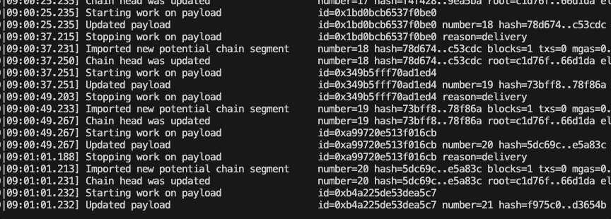

<div align="center">

# Deploy your own Local Ethereum PoS Testnet

[](./LICENSE)
[](https://github.com/mkenney/software-guides/blob/master/STABILITY-BADGES.md#experimental)


</div>

This deployment process allows you to setup and deploy your own local ethereum PoS networks with multiple nodes.
This repository is targeted to developers who want to quickly modify client source code and deploy a PoS network.
This setup can is can serve as a reference for building your own production deployments but better solutions exist for [that](https://docs.kurtosis.com/how-to-compose-your-own-testnet/) use case. I'm personally using this for simulating reorgs and byzantine behaviour.


## Installation
This project utilizes Git submodules to reference the client code, notably Go-Ethereum and Prysm.
However, the scripts can be configured to reference binaries you build locally, making development quicker.

 **You will need Go 1.20 and JQ installed**. 

```bash
git clone --recursive https://github.com/rzmahmood/ethereum-pos-testnet.git
```

A helper script that builds the submodules, saving the binaries in a known path
```bash
./build-dependencies.sh
```

## Running

Start testnet. This will start a test with a two validators. You should expect blocks to be produced. Logs are stored in `./network/node-*/logs`
The script is idempotent and will clean up every time it is restarted.
```bash
./testnet.sh
```



In a new shell, you can then attach to any of the generated nodes. 
If you have `geth` in your path you can run:

```bash
geth attach network/node-0/execution/geth.ipc 

> net.peerCount
> eth.blockNumber
```
Alternatively, you can use the built version of geth

```bash
./dependencies/go-ethereum/build/bin/geth attach network/node-0/execution/geth.ipc 

> net.peerCount
> eth.blockNumber
```

You can also interact with a beacon node you spin up
```bash
curl localhost:4100/eth/v1/node/identity
```

You can change the number of nodes to run by changing this line in `./testnet.sh`
```bash
# Change this number for your desired number of nodes
NUM_NODES=2
```

If you want to try submitting transactions, add your address to the `alloc` field in `./genesis.json` before running the testnet. This will premine your address some funds.
```json
"alloc": {
    // Replace with your address
    "123463a4b065722e99115d6c222f267d9cabb524": {
        "balance": "0x43c33c1937564800000"
    },
```
You can then send transactions using [cast](https://book.getfoundry.sh/cast/) while the network is running
```bash
# Get balance of an address
cast balance -r localhost:8000 0xFe8664457176D0f87EAaBd103ABa410855F81010

# Send 0.01 ether to 0x8D...8E
cast send -r localhost:8000 --private-key $PKEY 0x8D512169343cc6e108a8bB6ec5bc116C416eFc8E --value 0.01ether
```

Reach out to me on Twitter [@0xZorz](https://twitter.com/0xZorz) if you have any issues. DMs are open

## Coming Soon
- Deposits and Withdrawals

## Acknowledgements

- The [work](https://github.com/OffchainLabs/eth-pos-devnet) of Raul Jordan was a great reference starting point. His setup will suffice requirements that don't demand signficant customization and only require 1 node.
